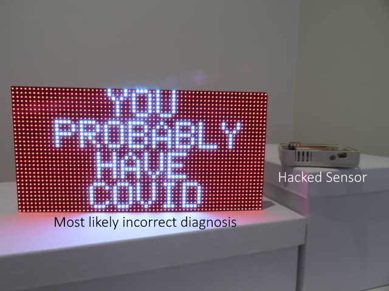
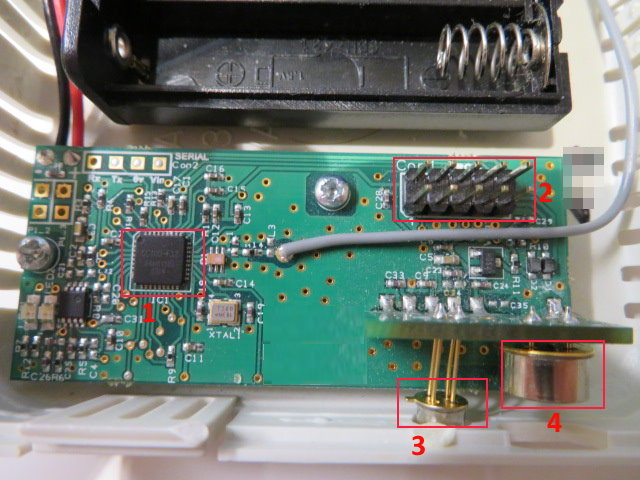
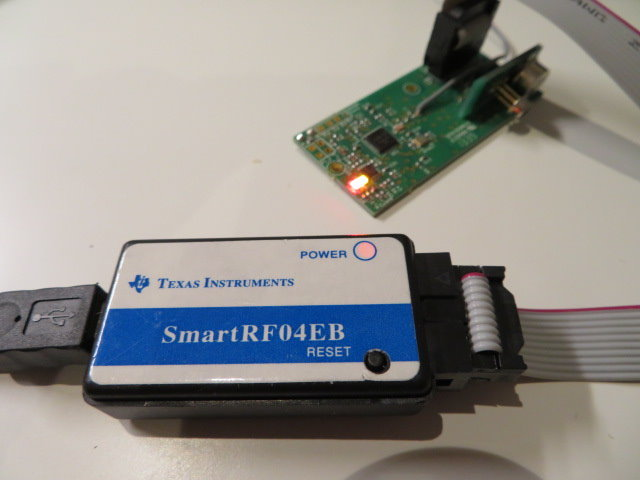

# [TL/DR](https://www.urbandictionary.com/define.php?term=tl%3Bdr)

 - Prior to Wuhan-virus pandemic, a certain organisation thought it would be a good idea to stick sensors under employees desks to monitor office-space ‘desk  utilisation’. **These sensors pointed at the groin...**
 - Management later 'abandoned' the monitoring, and these sensors were destined to become e-waste.
 - A sensor was salvaged prior to the office being closed forever and reverse engineered, turning its nefarious existence into a useful one – that being **a Covid-19 symptom detector (high temp)**.
 - The reverse-engineering was only possible due to the unabated boredom caused by the pandemic ‘stay at home’ lockdown(s).
 

# Hacking an employee monitoring sensor (story time)
Below is a picture of one of these sensors hidden under a desk.


## Looking inside 
Upon opening the device, the potential for reverse-engineering was realised given:
1. A well-documented Texas Instruments (TI) processor was used. The  [CC1110]( https://www.ti.com/product/CC1110-CC1111). If it was some otherwise unknown or no-name Chinese chip the only option was the trash bin.
2.  A programming port was available. The possibility to flash custom firmware (software) onto it easily... just need to know how to write such software.
3. Component ‘3’ is a ‘thermopile’ Infra-red detector – the type used in IR sensor ‘guns’ that are used at airports to check your temperature from a distance, or in industry to check the temperature of a surface from a distance. A very 'cool' component by itself.
4. Component ‘4’ is a standard passive infra-red motion detector, the same type used in a sensor-light. A useful component by itself.



## Connecting a USB programmer
* To use the programming (aka. hacking) port of the sensor, a Texas Instrument ‘USB flash programmer’ was required to connect the sensor to a PC and overwrite the firmware (software) on the device via. the programming port. 
* Fortunately, a USB flash programmer is about ~$5 from Aliexpress. Once connected the sensor's LEDs lit up! 
* Using the USB flash programmer it was possible to extract the existing software off the device, but it was encrypted and was too complex to reverse engineer... so writing something from scratch was the only way forward.



## Writing basic custom firmware for the sensor 
* After Googling, a basic test program was copy-pasted to 'toggle' the on-board LEDs on such a TI processor, which amazingly worked on this sensor. 
```c
// https://www.instructables.com/8051-Programming-Using-Small-Device-C-Compiler-SDC/ 
#include <8052.h>
void delay(void);
void main(void)
{
    while(1)
    {
         P1 = 0xFF; // Turn ON all LED's connected to Port1
         delay();
         P1 = 0x00; // Turn OFF all LED's connected to Port1
         delay();
    }
}
 
void delay(void)
{
    int i,j;
    for(i=0;i<0xff;i++)
         for(j=0;j<0xff;j++);
}
```
The next step was to go all-in and write a complete firmware from scratch that would a) Read measurements from the onboard sensors; and b) Transmit these measurements over the air.

However this raised the problem in that:
* This transmitter uses a proprietary radio ('RF') that is not able to be 'heard' unless you have a corresponding chip of the same type! It's not WiFi!
* Therefore, even if a working custom firmware was written, there was no means to listen to the transmitted sensor output...


## So.... creating a sensor data receiver 
* Fortunately similar TI radio transceiver chips can be bought for ~$1 from China and connected to any hardware, such as a Raspberry Pi or Arduino.
* And after **much** painstaking trail-and-error, the result was the creation of an [entirely separate software library to control these transceiver (receiver) chips](https://github.com/mrfaptastic/Easy-IoT-Arduino-CC1101-LORA) when connected to any cheap microprocessor. 
* The result? The ability to receive data from one of these sensors after writing some super basic sensor transmit firmware.


## Finishing it all up
So, now there were two pieces that needed to be completed:
1) Firmware for the hacked sensor i.e. Creating software that basically 'reads' the sensor values every X seconds and transmits. FYI - The code [can be found here](https://github.com/mrfaptastic/Employee-Monitoring-Sensor-Hack-CC1110/blob/main/cc1110-sensor-fw/sensor-main.c), but is absolutely useless unless you happen to find one of these sensors in a local bin...
2) Firmware for the custom data receiver which I **also** connected to a large LED Matrix Panel because WHY NOT! This used another software library I'd written [to display stuff on a large LED Matrix Panel](https://github.com/mrfaptastic/ESP32-HUB75-MatrixPanel-I2S-DMA)!


## Result
The former employee/slave monitoring sensor sends:
* Ambient temp. of the room
* The temp. of the object directly in front of it (i.e. Your head!); and
* Whether movement has been detected.

The receiver collects this, sends this it to the receiving microprocessor and displays on the LED Matrix Panel. COOL!

Here's a example of what is sent over the air:
```
V|33|D|000203|000134|000406
battery: 33.00
Temperature:	23.85C		297.00K		74.94F
IR temperature:	27.07
V|33|D|000221|000133|000407
battery: 33.00
Temperature:	23.76C		296.91K		74.77F
IR temperature:	26.87
V|33|D|000213|000134|000407
battery: 33.00
Temperature:	23.76C		296.91K		74.77F
IR temperature:	27.07
V|33|D|000208|000134|000406
battery: 33.00
Temperature:	23.85C		297.00K		74.94F
IR temperature:	27.07
```


## Conclusion
* Completely pointless but cool hack. Can use as a IR temperature sensor. 
* The kettle after boiling always shows symptoms of Covid-19 according to the advanced logic that determines what to display on the LED Matrix Panel: 
```
if (temp > 37.5) { covid = true; }
```
* Wasted a couple of nights coding this which should have been better spent watching cat videos on YouTube.

